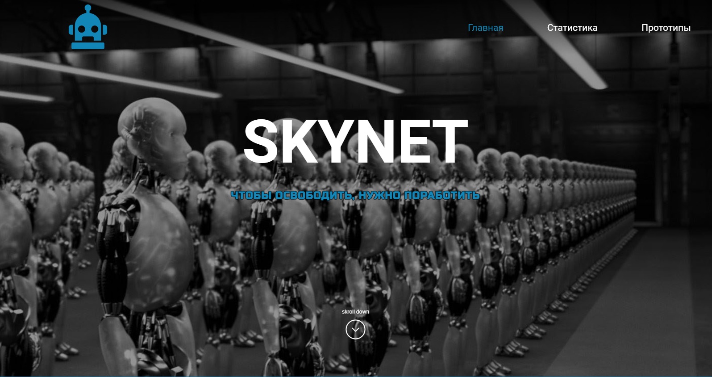

# <a id="top" />SKYNET

---

### Оглавление
  - [Описание](#description)
  - [Ссылки](#references)
  - [Автор](#autor)

---

## <a id="description" />Описание

Если бы роботы ополчились на людей, разве у них не было бы своего сайта? Возможно он был бы таким.
  - Реализованы модальные окна
  - Реализованы различные графики совместно с диаграммами и подсказками
  - Выполнена адаптивная верстка

  - В Разработке раздел "Прототипы"(3стр. на React) - подобие магазина(с корзиной и избранным)

Проект выложен на Vercel (см. раздел "Ссылки")

### Технологии

- PUG
- SCSS
- JS
- Webpack
- React
---

### <a id="references" />Ссылки

Посмотреть проект можно [&rsaquo; тут &lsaquo;](https://skynet-ecru.vercel.app)

---

### <a id="autor" />Автор

Никита Кравец

  - [GitHub](https://github.com/LSD237)
  - [VK](https://vk.com/id6725831)

[Наверх](#top)